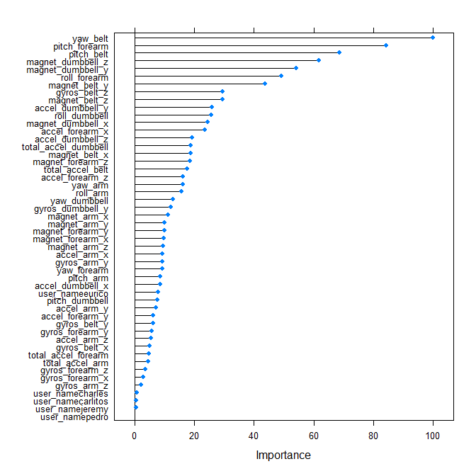

## Synopsis
The goal of this project is to build, train and evaluate a classification model (for predicting the manner in which people did the exercise) based on data from the research paper [_"Qualitative Activity Recognition of Weight Lifting Exercises"_](https://web.archive.org/web/20161224072740/http:/groupware.les.inf.puc-rio.br/har) (see the section on the _Weight Lifting Exercise Dataset_).


## Background
The purpose of the researchers' original experiment was to assess whether mistakes in weight-lifting exercises could be detected by using activity recognition techniques.
They recorded users performing the same activity correctly and with a set of common mistakes with wearable sensors.


## Data
According to the project instructions, we are supposed to use the following datasets (but not the original [_WLE dataset_](http://web.archive.org/web/20161224072740/http://groupware.les.inf.puc-rio.br/static/WLE/WearableComputing_weight_lifting_exercises_biceps_curl_variations.csv) from the research paper):

* https://d396qusza40orc.cloudfront.net/predmachlearn/pml-training.csv - as the training data
* https://d396qusza40orc.cloudfront.net/predmachlearn/pml-testing.csv - as the test data

The `classe` variable in the __training set__ represents the observed outcome (type of activity) and, being categorical, assigns the observation to the following classes: class `A` corresponds to the correct execution of the exercise, while the other 4 classes (classes `B`, `C`, `D` and `E`) correspond to common mistakes.
This variable is missing in the __test set__ and must be predicted by our model.


## Getting and Cleaning Data
The `pml-training.csv` data set is a data frame with 19622 observations on 160 variables.  

```r
rawTraining <- read.csv("pml-training.csv",header=TRUE,na.strings=c("NA","#DIV/0!",""))  # raw training data
dim(rawTraining)  # dimension of the dataset
```

```
## [1] 19622   160
```

### Missing Values
The dataset appears to have missing values (coded as NA) that need handling.

```r
VariablesWithNA <- apply(rawTraining,2,anyNA) ; sum(VariablesWithNA)  # list of variables with NA
```

```
## [1] 100
```

```r
summary( colMeans( is.na(rawTraining[,VariablesWithNA]) ) )  # statistics on proportion of NA's
```

```
##    Min. 1st Qu.  Median    Mean 3rd Qu.    Max. 
##  0.9793  0.9793  0.9793  0.9811  0.9798  1.0000
```

100 variables contain NA's. Since the proportion of missing values in each of these variables is very high (minimum 0.9793), it does make sense to remove these features from the dataset. 

```r
cleanTraining <- rawTraining[,!VariablesWithNA] ; dim(cleanTraining)  # features with NA's removed
```

```
## [1] 19622    60
```


## Exploratory Data Analysis
The first six features (skipping the `user_name` variable) appear irrelevant to the outcome so we can remove them as well.  

```r
cleanTraining2 <- cleanTraining[,-c(1,3:7)] ; dim(cleanTraining2)  # irrelevant features removed
```

```
## [1] 19622    54
```

### Zero- and Near Zero-variance predictors
Here we examine so-called _"zero-variance"_ and _"near zero-variance"_ predictors that may cause problem for some models.  
Although in this case, there are none to worry about.

```r
library(caret) ; library(randomForest) ; library(gbm)  # load the libraries 
```

```r
nearZeroVar(cleanTraining2)  # check for "near zero-variance" predictors
```

```
## integer(0)
```

### Multicollinearity
Here we examine the remaining data for highly correlated predictors that some models are susceptible to.  

```r
tmpHighCorrVar <- findCorrelation( cor(cleanTraining2[,-c(1,54)]) )  # highly correlated variables
HighCorrVarNames <- names(cleanTraining2[,-c(1,54)])[tmpHighCorrVar] ; HighCorrVarNames  # variable names
```

```
## [1] "accel_belt_z"     "roll_belt"        "accel_belt_y"     "accel_belt_x"    
## [5] "gyros_dumbbell_x" "gyros_dumbbell_z" "gyros_arm_x"
```

7 variables are found to have high pairwise correlation (>0.9) and we remove them from the training dataset.

```r
cleanTraining3 <- within(cleanTraining2, rm(list=HighCorrVarNames))  # correlated features removed
dim(cleanTraining3)  # dimension of the final training dataset
```

```
## [1] 19622    47
```


## Model Selection and Building
Since we must predict a qualitative (categorical) response, it makes sense to apply and compare several classification techniques covered in the class e.g. Random Forests (method `rf`), Boosting (method `gbm`) and Linear Discriminant Analysis (method `lda`).  
For estimating the test (_out of sample_) error, we use the 10-fold cross-validation approach with the training data, and the resulting accuracy and error rate provide an optimistic estimate of model performance on a new (an independent) data set.

```r
set.seed(12345)
modRF  <- train(classe ~ . , data=cleanTraining3, method="rf", trControl=trainControl(method="cv",number=10))

set.seed(23456)
modGBM <- train(classe ~ . , data=cleanTraining3, method="gbm", trControl=trainControl(method="cv",number=10))

set.seed(34567)
modLDA <- train(classe ~ . , data=cleanTraining3, method="lda", trControl=trainControl(method="cv",number=10))
```

The following table summarizes the resampling (cross-validation) results for our models.  

```r
rbind( getTrainPerf(modRF), getTrainPerf(modGBM), getTrainPerf(modLDA) )
```

```
##   TrainAccuracy TrainKappa method
## 1     0.9954644  0.9942627     rf
## 2     0.9618290  0.9517063    gbm
## 3     0.6964660  0.6154930    lda
```
Among our three candidates, the _Random Forests_ model has the best accuracy ($0.9955$, error rate $0.0045$, see _Appendix_ for more detail) with which we can predict the response for observations not used in model training.


## Predictions
In this final section, we apply the resulting machine learning algorithm to the test dataset.

```r
TestData <- read.csv("pml-testing.csv",header=TRUE,na.strings=c("NA","#DIV/0!",""))  # load the test data
dim(TestData)  # dimension of the test dataset
```

```
## [1]  20 160
```

```r
predRF <- predict(modRF, TestData) ; predRF  # getting predictions
```

```
##  [1] B A B A A E D B A A B C B A E E A B B B
## Levels: A B C D E
```

***

## Appendix

### Figure 1. Summary of the _Random Forests_ model


```r
print.train( modRF, printCall=TRUE, selectCol=TRUE, digits=4 )
```

```
## Random Forest 
## 
## 
## Call:
## train.formula(form = classe ~ ., data = cleanTraining3, method =
##  "rf", trControl = trainControl(method = "cv", number = 10))
## 
## 19622 samples
##    46 predictor
##     5 classes: 'A', 'B', 'C', 'D', 'E' 
## 
## No pre-processing
## Resampling: Cross-Validated (10 fold) 
## Summary of sample sizes: 17660, 17660, 17661, 17658, 17661, 17660, ... 
## Resampling results across tuning parameters:
## 
##   mtry  Accuracy  Kappa   Selected
##    2    0.9938    0.9921          
##   26    0.9955    0.9943  *       
##   50    0.9901    0.9875          
## 
## Accuracy was used to select the optimal model using the largest value.
## The final value used for the model was mtry = 26.
```

### Figure 2. Resampling results
The resulting model accuracy is the average accuracy of the 10 held-out folds.

```r
modRF$resample
```

```
##     Accuracy     Kappa Resample
## 1  0.9949032 0.9935513   Fold02
## 2  0.9938838 0.9922639   Fold01
## 3  0.9954175 0.9942037   Fold04
## 4  0.9954105 0.9941945   Fold03
## 5  0.9984709 0.9980658   Fold06
## 6  0.9954105 0.9941944   Fold05
## 7  0.9959204 0.9948397   Fold08
## 8  0.9979623 0.9974226   Fold07
## 9  0.9913398 0.9890462   Fold10
## 10 0.9959246 0.9948448   Fold09
```

```r
print( colMeans(modRF$resample[1:2]) , digits=4 )
```

```
## Accuracy    Kappa 
##   0.9955   0.9943
```

### Figure 3. Predicting on the full training data


```r
confusionMatrix( predict(modRF,cleanTraining3) , as.factor(cleanTraining3$classe) )
```

```
## Confusion Matrix and Statistics
## 
##           Reference
## Prediction    A    B    C    D    E
##          A 5580    0    0    0    0
##          B    0 3797    0    0    0
##          C    0    0 3422    0    0
##          D    0    0    0 3216    0
##          E    0    0    0    0 3607
## 
## Overall Statistics
##                                      
##                Accuracy : 1          
##                  95% CI : (0.9998, 1)
##     No Information Rate : 0.2844     
##     P-Value [Acc > NIR] : < 2.2e-16  
##                                      
##                   Kappa : 1          
##                                      
##  Mcnemar's Test P-Value : NA         
## 
## Statistics by Class:
## 
##                      Class: A Class: B Class: C Class: D Class: E
## Sensitivity            1.0000   1.0000   1.0000   1.0000   1.0000
## Specificity            1.0000   1.0000   1.0000   1.0000   1.0000
## Pos Pred Value         1.0000   1.0000   1.0000   1.0000   1.0000
## Neg Pred Value         1.0000   1.0000   1.0000   1.0000   1.0000
## Prevalence             0.2844   0.1935   0.1744   0.1639   0.1838
## Detection Rate         0.2844   0.1935   0.1744   0.1639   0.1838
## Detection Prevalence   0.2844   0.1935   0.1744   0.1639   0.1838
## Balanced Accuracy      1.0000   1.0000   1.0000   1.0000   1.0000
```

### Figure 4. Variable Importance


```r
plot(varImp(modRF))
```

<!-- -->

***
